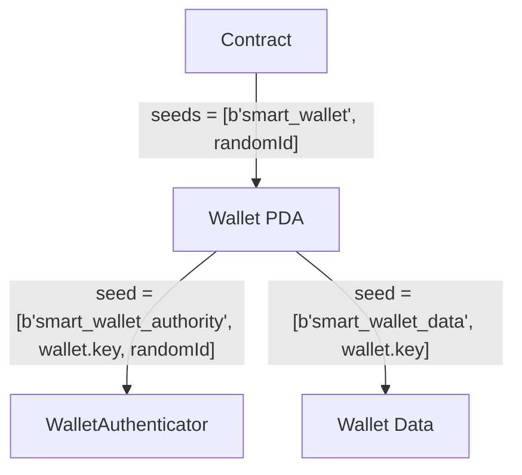

# PDA architecture



# PDA Ownership

```mermaid
    flowchart LR
        n7["Device"] --> n8["Passkey"]
        n8 --> n9["WalletAuthenticator<br>"]
        n10["Wallet PDA"] --> n9 & n14["WalletAuthenticator<br>"]
        n12["Device"] --> n13["Passkey"]
        n13 --> n14 & n15["WalletAuthenticator<br>"]
        n11["Wallet PDA"] --> n15
        n7@{ shape: diamond}
        n12@{ shape: diamond}
        n9@{ shape: hexagon}
        n14@{ shape: hexagon}
        n15@{ shape: hexagon}
````
